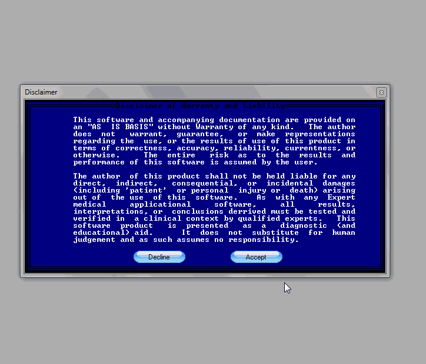



## Color Vision Ishihara Amsler

### Description

[Update: 3-2-2011: A small bug fixed. You can trace the Amsler defects, Save and Recall them now: Here's the online Help File: http://tinyurl.com/4eqjks5 ] [ Update 2-28-2011: Some errors were repaired and Protan/Deutan discrimination added ] This application allows one to measure their color vision using the Ishihara (16 of 32) Charts. It will interpret your answers and provide documentation and instruction. A Red Chart is provided to assess Red Desaturation (optic nerve/tract). An Amsler Chart is provided to assess Macular Function. The colors may not reproduce accurately depending on the calibration of your monitor and the quality of the charts provided.
 
### More Info
 

             |
---                |---
**Submitted On**   |2011-03-02 10:58:32
**By**             |[Warren Goff](https://github.com/Planet-Source-Code/PSCIndex/blob/master/ByAuthor/warren-goff.md)
**Level**          |Beginner
**User Rating**    |5.0 (10 globes from 2 users)
**Compatibility**  |VB 6\.0
**Category**       |[Complete Applications](https://github.com/Planet-Source-Code/PSCIndex/blob/master/ByCategory/complete-applications__1-27.md)
**World**          |[Visual Basic](https://github.com/Planet-Source-Code/PSCIndex/blob/master/ByWorld/visual-basic.md)
**Archive File**   |[Color\_Visi219900322011\.zip](https://github.com/Planet-Source-Code/warren-goff-color-vision-ishihara-amsler__1-73768/archive/master.zip)

